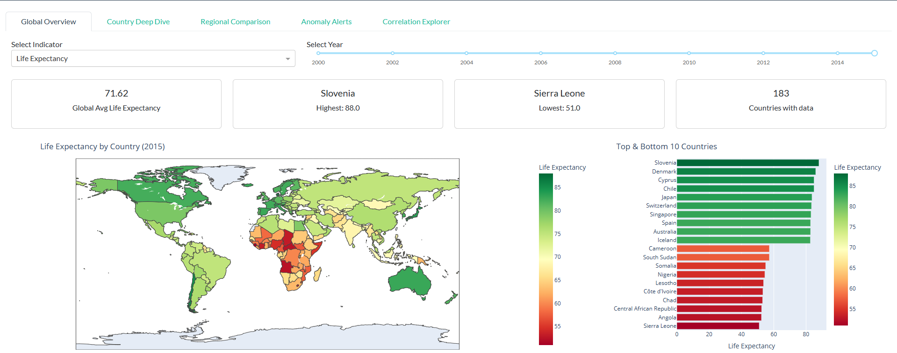
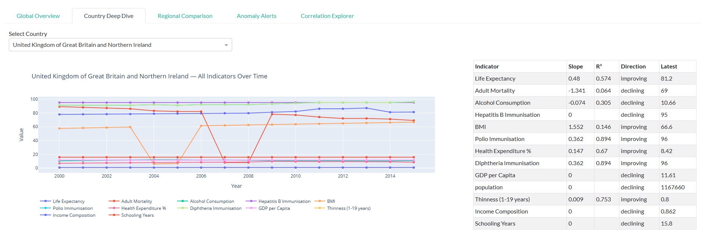
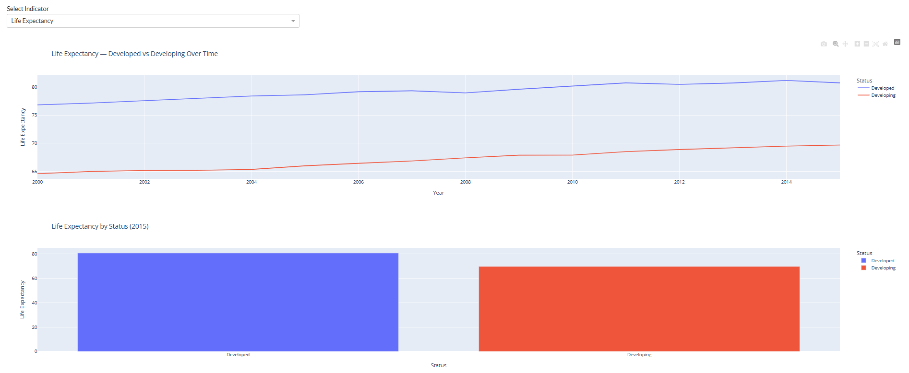
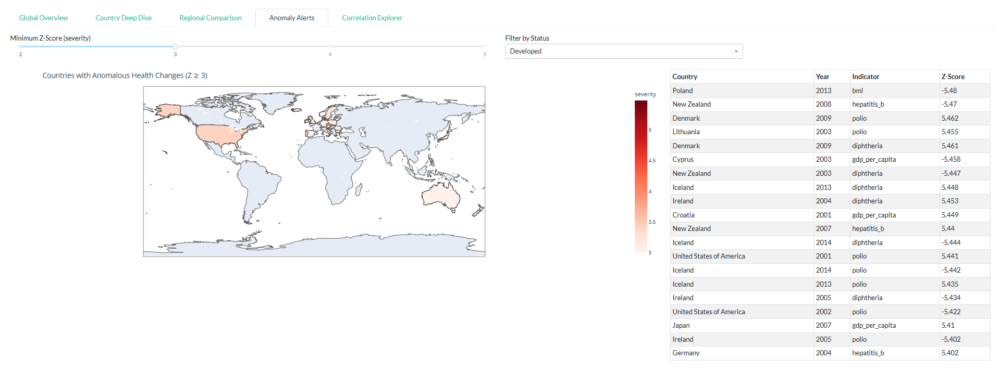
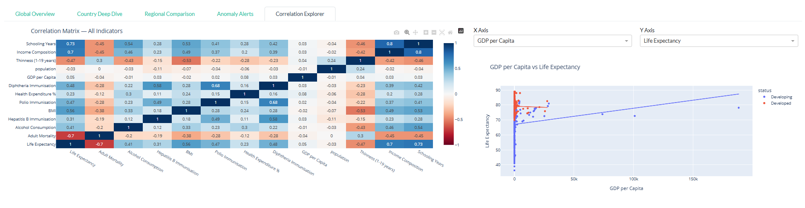

# WHO Global Health Analytics Dashboard
### Python · Dash · Plotly · Pandas · SciPy · Docker · Hugging Face

## Live Dashboard
[View Live Dashboard](https://pro580-who-global-health-dashboard.hf.space)

## GitHub Repository
[View Source Code](https://github.com/habeeb-prog/who-global-health-dashboard)

---

## Overview
An end-to-end data analytics platform built on WHO Global Health
Observatory data covering 193 countries across 16 years (2000-2015).
The project spans a full data engineering pipeline, statistical
analysis layer, EDA notebook and a deployed interactive web
application — answering real public health questions through
data-driven insights.

---

## Key Findings
- Global life expectancy improved by **4.9 years** between 2000 and 2015
- An **11-year gap** persists between developed and developing countries
- **Schooling** is the strongest positive predictor of life expectancy (r=0.728)
- **Sierra Leone (51 years)** vs **Slovenia (88 years)** — a 37-year gap
- Countries with high health expenditure live **6.2 years longer** on average
- **2,046 anomalous health changes** detected across 193 countries

---

## Dashboard Pages

### Page 1 — Global Overview
Interactive world map coloured by selected health indicator with year
slider, 4 KPI cards and top/bottom 15 countries bar chart.



### Page 2 — Country Deep Dive
Select any of 193 countries and explore all 12 health indicators
as trend lines across 16 years, with a regression trend table
showing slope, R² and direction per indicator.



### Page 3 — Regional Comparison
Developed vs Developing mean trend lines over time and latest
year comparison bar chart — showing whether the global health
gap is closing or widening.



### Page 4 — Anomaly Alerts
Z-score threshold slider filters countries where year-over-year
health changes exceeded 2-5 standard deviations from the regional
mean — surfacing wars, disease outbreaks and economic shocks in the data.



### Page 5 — Correlation Explorer
Full 12×12 correlation heatmap across all indicators plus an
interactive scatter plot with OLS trendline — revealing which
health factors drive life expectancy most strongly.



---

## Technical Architecture

### Data Pipeline — src/cleaning.py
- Loads raw WHO CSV and standardises all column names to snake_case
- Fills missing values using 3-pass median imputation:
  country-level → status-group → global median
- Validates value ranges using domain knowledge
- Engineers GDP per capita and decade features
- Outputs clean master dataset to data/processed/health_clean.csv

### Statistical Analysis — src/analysis.py
- Linear regression per country per indicator using SciPy
  producing 2,509 country-indicator trend pairs with slope and R²
- Z-score anomaly detection comparing year-over-year changes
  against regional mean and standard deviation — flagging 2,046
  statistically significant health shocks
- Pearson correlation matrix across all 12 indicators
- Regional benchmarks by developed/developing status and year

### EDA Notebook — notebooks/01_eda_who_global_health.ipynb
- Distribution analysis across all 12 indicators split by status
- Global life expectancy trend visualisation 2000-2015
- Developed vs developing comparison trend lines
- Full correlation heatmap with Seaborn
- Top and bottom 10 country rankings for 2015
- GDP per capita vs life expectancy scatter with outlier labelling
- Statistical summary of all key findings

### Web Application — app.py
- Multi-page Dash application with Bootstrap styling
- 5 fully interactive pages with dropdowns, sliders and filters
- Plotly choropleth maps, scatter plots, heatmaps and line charts
- Callback architecture for real-time interactivity
- Placeholder figures on empty selections to prevent crashes

### Deployment
- Dockerised with gunicorn WSGI server on port 7860
- Deployed on Hugging Face Spaces using Docker SDK
- GitHub Actions keep-alive workflow pings Space every 24 hours
  preventing the free tier 48-hour sleep — zero-cost 24/7 availability

---

## Tech Stack

| Layer | Tools |
|---|---|
| Language | Python 3.12 |
| Dashboard | Dash, Dash Bootstrap Components |
| Visualisation | Plotly |
| Data | Pandas, NumPy |
| Statistics | SciPy |
| EDA | Jupyter, Matplotlib, Seaborn |
| Deployment | Docker, Hugging Face Spaces, Gunicorn |
| Automation | GitHub Actions |

---

## Project Structure

```
who-global-health-dashboard/
├── app.py                              # main Dash application
├── Dockerfile                          # container configuration
├── requirements.txt                    # pinned dependencies
├── README.md                           # this file
├── .github/
│   └── workflows/
│       └── keep_alive.yml              # 24hr ping to prevent sleep
├── data/
│   ├── raw/                            # original WHO CSV files
│   └── processed/
│       ├── health_clean.csv            # cleaned master dataset
│       ├── trends.csv                  # regression results
│       ├── anomalies.csv               # flagged anomalies
│       ├── correlations.csv            # correlation matrix
│       └── benchmarks.csv             # regional benchmarks
├── src/
│   ├── cleaning.py                     # data pipeline
│   └── analysis.py                     # statistical analysis
├── notebooks/
│   └── 01_eda_who_global_health.ipynb  # exploratory analysis
└── screenshots/
    ├── page1_global_overview.png
    ├── page2_country_deepdive.png
    ├── page3_regional_comparison.png
    ├── page4_anomaly_alerts.png
    └── page5_correlation_explorer.png
```

---

## How to Run Locally

```bash
git clone https://github.com/prolynk/who-global-health-dashboard.git
cd who-global-health-dashboard
pip install -r requirements.txt
python src/cleaning.py
python src/analysis.py
python app.py
```

Then open `http://127.0.0.1:8050` in your browser.

---

## Data Source
WHO Global Health Observatory — Life Expectancy Dataset
193 countries · 2000-2015 · 22 health indicators

[Download Dataset](https://www.kaggle.com/datasets/kumarajarshi/life-expectancy-who)
